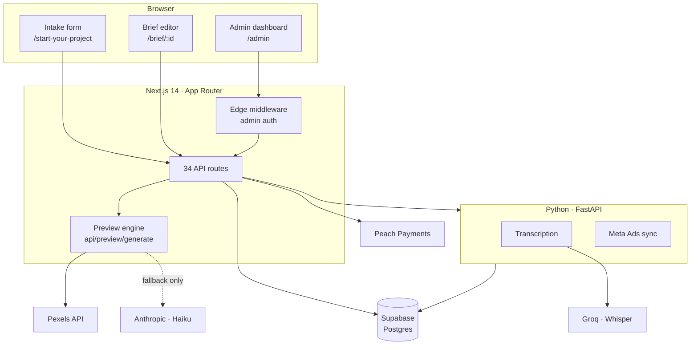
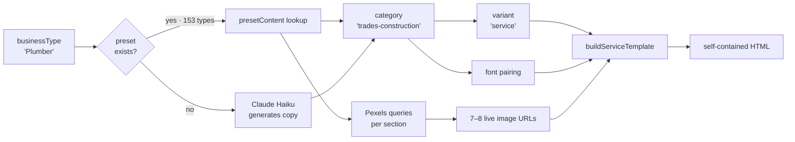
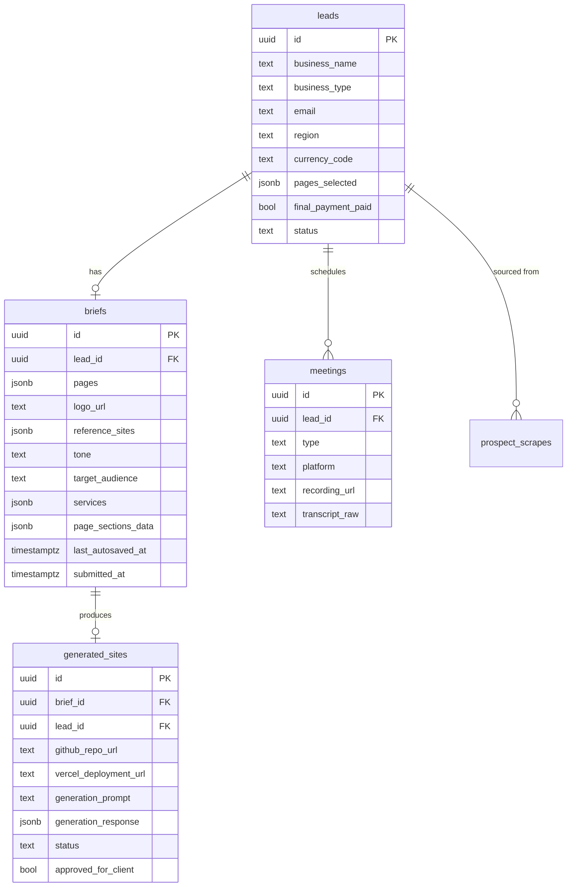

# Architecture

How Mountain Studios is put together, and why it was built this way.

- [System overview](#system-overview)
- [The preview engine](#the-preview-engine)
- [Data model](#data-model)
- [Client journey](#client-journey)
- [Supporting subsystems](#supporting-subsystems)
- [Authentication](#authentication)
- [Design decisions](#design-decisions)
- [Known limitations](#known-limitations)

---

## System overview

Two deployable units share one Postgres database.



The split is deliberate. Anything scheduled, long-running, or Python-native lives in the worker; anything request-scoped lives in Next.js. The two communicate over HTTP with a shared secret rather than a message queue — at this scale a queue would be infrastructure without a payoff.

---

## The preview engine

`app/api/preview/generate/` is the heart of the system. Two files, ~23,000 lines combined:

| File | Lines | Role |
|---|---|---|
| `content.ts` | 16,904 | 153 business-type presets — pure data |
| `route.ts` | 6,303 | Category mapping, template builders, HTML rendering |

### Resolution pipeline

A request carries a business name and a business type. Everything else is derived.



### Category → variant mapping

Fifteen categories collapse onto three layout variants (`route.ts`, `categoryVariant`):

| Variant | Categories | Character |
|---|---|---|
| `visual` | food-hospitality, retail, health-wellness, fitness-sport, pets, events-entertainment | Photography-led, large imagery, atmosphere over detail |
| `service` | tech-digital, professional, trades-construction, home-services, education, automotive, other | Icon grids, process steps, credibility signals |
| `portfolio` | creative, property | Gallery-first, work speaks before copy does |

The mapping is a lookup table, not a heuristic. A restaurant and a pet groomer genuinely want the same *shape* of page — big photos, short copy, clear booking CTA — even though their content differs entirely. Separating **content** (153 presets) from **layout** (3 variants) means adding a business type costs one data entry and no code.

### Preset shape

Each entry in `presetContent` is fully authored — no placeholders (`content.ts:4`):

```ts
export interface PresetContent {
  heroEyebrow: string
  heroAccent: string
  tagline: string
  heroSubtitle: string
  ctaPrimary: string
  ctaSecondary: string
  ctaNote: string
  badge: string
  servicesHeading: string
  services: { name; description; tags; icon?; serviceImageQuery }[]
  galleryHeading: string
  aboutHeading: string
  aboutText: string
  aboutMission: string
  stats: { value; label; sublabel }[]
  contactHeading: string
  contactHours?: string
  processSteps?: { step; title; description }[]
  stepsHeading?: string
  projectCaptions?: string[]
  testimonial: { quote; author; rating }
}
```

`serviceImageQuery` is the important field. Each service carries its own Pexels search string, so a plumber's "Emergency Callouts" card gets a photograph of an actual emergency callout rather than a stock office scene. Image relevance is what separates a preview that looks bespoke from one that looks generated.

### Rendering

Shared builders (`buildNav`, `buildHead`, `buildAboutSection`, `buildContactSection`, `buildFooter`) compose with one of `buildVisualTemplate` / `buildServiceTemplate` / `buildPortfolioTemplate`. Output is a **single HTML string** with:

- all CSS inline
- Google Fonts via `<link>`
- live Pexels CDN image URLs
- **no JavaScript**

No build step, no hosting, no framework. The file can be emailed, opened from disk, or dropped on any static host. For a sales artefact that needs to survive being forwarded around a client's business, that portability matters more than interactivity.

---

## Data model

Supabase Postgres. Core tables and their relationships:



Alongside these: `nurture` (email list with unsubscribe tracking), `ad_campaigns` (Meta Ads performance), `notifications` (admin alerts), `prospect_scrapes` (competitor site extraction — the only checked-in migration, at `supabase/migrations/prospect_scrapes.sql`).

### Lead status machine

`LeadStatus` (`types/index.ts:1`) has **17 states**, and they are the real specification of the business:

```
new → quoted → booked → meeting_one_done → brief_sent → brief_received
    → deposit_pending → deposit_paid → meeting_two_booked → meeting_two_done
    → awaiting_final_payment → final_payment_received → building → review → complete

                                    ↘ nurture        ↘ lost
```

Encoding the pipeline as an enum rather than a set of booleans means an invalid state is unrepresentable, and every dashboard filter is a single equality check.

---

## Client journey

### 1 — Intake and quoting

`app/start-your-project/page.tsx` → `app/api/leads/create/route.ts`

The visitor picks business type, style, colours and which pages they want, and gets a generated preview. **No quote is computed.** South Africa is the only market, so there is no region or currency step, and pricing is agreed per job rather than derived from a page count.

The old model — a GBP price list in `config/config.js` (£499 base + £99/page + £29/section), converted through `lib/fx.ts` against six-hourly Frankfurter rates — has been removed entirely, along with `app/api/fx/*` and the Python FX worker. It priced a South African product in pounds and disagreed with the separate ZAR price list that lived in `constants/pricing.ts`.

What survives in config is the deposit split:

```js
pricing: {
  depositPercentage: 50,
}
```

The rand amount is entered by an admin on `POST /api/admin/leads/[id]/send-brief` as `amount_zar`, written to `briefs.final_price_local`, and the deposit derived from it. That endpoint is the only writer of a brief's price, and `app/api/payments/create-checkout` refuses to run without it.

### 2 — Brief collection

`app/brief/[id]/page.tsx` → `autosave/route.ts` → `submit/route.ts`

A long multi-step form: logo upload, reference sites, tone, audience, per-page section content. Autosave fires on a 30-second debounce against a dedicated endpoint separate from submission — a partial brief is always valid to persist, whereas submission has completeness requirements. Two endpoints, two contracts.

### 3 — Preview generation

Triggered by an admin from the lead dashboard (`app/api/admin/briefs/[id]/generate/route.ts`), which calls the engine described above. Kept admin-triggered rather than automatic so that no client sees a preview nobody has sanity-checked.

### 4 — Deposit

`payments/create-checkout/route.ts` → Peach hosted checkout → `payments/webhook/peach/route.ts`

50% deposit. Status advances to `deposit_paid` **on the webhook**, never on the browser redirect — the redirect is a UX convenience and is trivially forged; the webhook is the source of truth.

### 5 — Meetings and transcription

`bookings/create/route.ts`, `lib/meetings/`, `worker/main.py`

Three meeting types (discovery, brief review, progress review) across four platform options. `MEETING_PLATFORM` selects the adapter at runtime, so switching the whole agency from Teams to Google Meet is an environment variable rather than a refactor.

Recordings are transcribed by the Python worker via Groq. Groq over OpenAI Whisper on cost and latency — transcription here is a background convenience, not a user-facing feature, so throughput beats marginal accuracy.

---

## Supporting subsystems

**Email** — `lib/email.ts` over SMTP via nodemailer, with EmailJS on the client for the contact path. `api/nurture/unsubscribe` handles list removal.

**Notifications** — `lib/notifications.ts` writes to the `notifications` table and optionally forwards to a webhook, driving the admin notification centre.

**Image proxy** — `api/proxy-image` fronts external images so `next.config.js` can restrict remote patterns to the Supabase CDN while still rendering third-party imagery.

**Templates in progress** — `templates/redesigned-*.ts` holds the partially complete migration from 3 shared variants to 15 category-specific layouts. Not yet wired into the generation path.

**Chatbot** — `components/site/ChatWidget.tsx` → `api/chat` → DeepSeek, with `lib/chatbot/knowledge.ts` as the only thing it is allowed to say. The knowledge base and the system prompt are one file of plain strings, injected whole on every request rather than retrieved or ranked; that is the entire gatekeeping mechanism, and it only works while the file stays server-side. The route is stateless — the client posts the full conversation each turn — and returns plain text rather than using the model's JSON mode, so contact details are extracted from the visitor's own words with regexes instead of depending on the model to format them. Captured leads land in `leads` alongside the wizard's, matched on email within 30 days. `lib/chatbot/questions.ts` logs every question to `chat_questions` and serves approved answers from it without calling the model, matching on a trigram Dice coefficient computed in TypeScript; every function there is best-effort, so an absent table degrades to "always ask the model" rather than an error.

The chatbot can also start a free audit, but it does not run one: `api/chat` returns the website and email it extracted from the visitor's own words, and the widget posts them to `api/audit/submit`. Both alternatives were tried on production and both failed — rendering in the chat function needs the 66MB browser there, whose cold start exceeds the model timeout and takes the whole chatbot down, and a server-to-server call to `api/audit/run` never landed, leaving rows stuck at `status='new'`. Chrome is traced into `/api/audit/**` only; a new caller hands off to the submit endpoint rather than being added to `outputFileTracingIncludes`.

**Website audit** — `app/api/audit/run` over `lib/audit/`: `checks.ts` (SSL, security headers, and PageSpeed Insights on mobile and desktop), `copy.ts` (canned findings keyed off pass/fail and score bucket), `run.ts` (orchestration, writing to `audit_requests.report`), and `email.ts` (the report email). Triggered by `api/audit/submit` itself once it has captured the lead, from the free-audit popup (`components/site/AuditPopup.tsx`) rather than a homepage section — it fires after 30 seconds on the site or on exit intent, once per visit.

---

## Authentication

There is no user auth. Clients reach their brief through an unguessable UUID URL; only the admin surface is protected.

Admin auth is deliberately minimal (`middleware.ts`):

- the session cookie value is `sha256(ADMIN_PASSWORD)`
- Edge middleware compares it against the expected hash on every `/admin` request
- comparison is **constant-time** — a length check plus XOR accumulation, avoiding the early-exit that makes naive string comparison timing-attackable
- if `ADMIN_PASSWORD` is unset, `expectedCookieValue()` returns `''` and authentication **fails closed** rather than open
- 8-hour expiry

Single-operator tool, single shared secret. A full identity system would be more machinery than the threat model justifies — but the two failure modes that actually matter (timing leaks, missing-config fail-open) are handled explicitly.

---

## Design decisions

**Presets before LLM.** The obvious build is "ask Claude to write a website for a plumber". It is also slower, costlier per lead, and non-deterministic — the same business type yields different quality on different days, and a bad roll goes straight to a paying prospect. Hand-authoring 153 presets is a large upfront cost that buys instant, free, reviewable output for the overwhelming majority of leads. Claude covers the long tail, where variance is acceptable because the alternative is nothing.

**Content and layout separated.** 153 content presets × 3 layout variants, rather than 153 templates. New business types cost a data entry.

**Self-contained HTML output.** No JS, no build, no hosting dependency. The artefact outlives the system that made it.

**Config over code.** The deposit split, meeting durations, and ad thresholds live in `config/config.js` because they change on business rhythm, not engineering rhythm.

**Pricing per job, not per page.** A page-count formula priced the artefact rather than the work, and forced a currency engine on a single-currency business. An admin enters the agreed rand amount instead.

**Webhooks as payment truth.** Client-side redirects are advisory.

**Adapters for meeting platforms.** Agencies change tooling; the switch should be configuration.

---

## Known limitations

Honest accounting of what a reviewer would find:

- **`route.ts` is 6,303 lines.** The template builders should be separate modules. It grew organically and the 15-category refactor is the intended point to break it up.
- **One checked-in migration.** Schema evolved largely through the Supabase dashboard, so `supabase/migrations/` does not reproduce the database. The schema is recoverable from `types/index.ts` but that is documentation, not a migration path.
- **No test suite.** Solo project, manual QA against the rules in `QA_RULES.md`.
- **`templates/old/`** is retained deliberately as an iteration record, not accidentally.
- **Preview generation is synchronous.** Fine at 7–8 Pexels calls, but it blocks the request; the worker is the natural home for it if generation grows.
- **The 15-category refactor is incomplete** — `property` is built, the rest are not, and the new builders are not yet reachable from the generation path.
