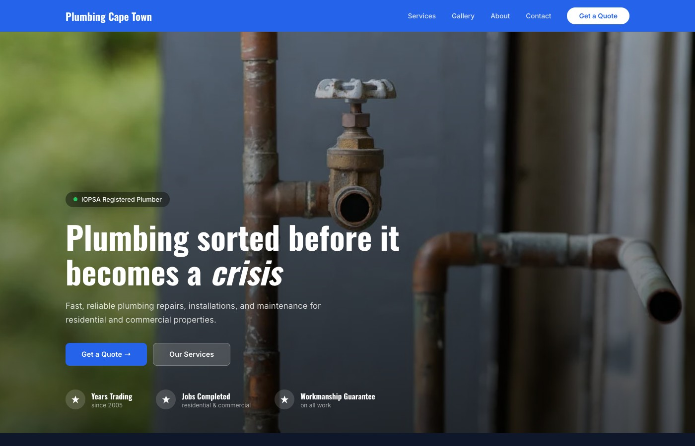

# Mountain Studios

**A web design agency run as software.** Client fills in a brief, the platform generates a complete, self-contained website preview in seconds — before a designer has touched anything.



*Above: a preview generated for the business type "Plumber" — no human input beyond the business name and category.*

---

## The problem

Selling web design work means spending unpaid hours producing speculative mockups for leads who may never convert. The pitch is abstract until the client sees *their* site, and most drop out before that point.

Mountain Studios closes that gap. A lead enters their business type and picks their pages; the platform returns a finished, styled, single-page website populated with copy and photography appropriate to their trade. The sales conversation starts with something real on screen.

The whole client journey — intake, quoting, scheduling, briefing, deposit collection, transcription — runs through the same system.

---

## The preview engine

This is the core of the project and the part worth reading.

Generating a plausible website for an arbitrary business is mostly a content problem, not a layout problem. A generic template filled with lorem ipsum reads as a template. So the system leans on **pre-written content rather than live LLM generation** for the common cases:

- **153 business types** have hand-authored preset content — "Restaurant", "Bakery", "Plumber", "Lawyer / Attorney", "Graphic Designer", and so on. Each preset carries its own hero copy, taglines, service descriptions, statistics, process steps, testimonial, and per-section Pexels search queries.
- **15 categories** group those types (`food-hospitality`, `trades-construction`, `property`, `creative`, …), each with its own Google Font pairing and visual register.
- **3 layout variants** render them — `visual` (photography-led), `service` (icons and process steps), `portfolio` (gallery-led). Categories map to variants deterministically.

```
"Plumber"  →  category: trades-construction  →  variant: service
                            ↓                            ↓
                 preset copy + image queries    buildServiceTemplate()
                            ↓                            ↓
                     Pexels API (7–8 images)  →  self-contained HTML
```

Claude (Haiku) is the **fallback**, not the default — it only runs for business types with no preset. This keeps generation fast, free, and deterministic for the ~153 types that cover most inbound leads, while still handling the long tail.

Output is a single HTML file with inline CSS, live Pexels image URLs, and no external JavaScript. It opens anywhere, needs no build step, and can be emailed as an attachment.

---

## What else is in here

| Capability | Notes |
|---|---|
| **Lead intake & quoting** | Multi-step form; price computed as £499 base + £99/page + £29/extra section, converted live into the client's local currency |
| **Multi-currency FX** | A Python worker refreshes rates every 6 hours so quotes render in ZAR, AUD, EUR etc. rather than GBP |
| **Brief collection** | Long-form client brief with 30-second debounced autosave, so nobody loses an hour of typing |
| **Meeting scheduling** | Pluggable across Microsoft Teams, Zoom, and Google Meet via a single `MEETING_PLATFORM` switch |
| **Transcription** | Meeting recordings transcribed through Groq — chosen over Whisper on cost and latency |
| **Payments** | Peach Payments checkout for the 50% deposit, confirmed by webhook |
| **Admin dashboard** | Lead pipeline, notifications, brief review, manual preview triggering |

---

## Stack

**Frontend / API** — Next.js 14 (App Router), TypeScript, Tailwind, GSAP + Lenis for motion
**Database** — Supabase (Postgres)
**Worker** — Python, FastAPI, APScheduler
**AI** — Anthropic SDK (Haiku) for fallback copy, Groq for transcription
**Imagery** — Pexels API
**Payments** — Peach Payments
**Auth** — `iron-session` + SHA-256 hashed admin cookies enforced in Edge middleware

---

## Repository layout

```
app/                    Next.js routes — 7 pages, 34 API endpoints
  api/preview/generate/ The preview engine
    content.ts          153 business-type presets (16,904 lines)
    route.ts            Template builders and rendering (6,303 lines)
components/             Shared UI
lib/                    Auth, email, Supabase admin client, FX, payments, notifications
worker/                 Python FastAPI service — FX refresh, transcription, ads
templates/              Category-specific template work (in progress)
template-previews/      Five static reference designs
config/config.js        Pricing, meeting durations, ad thresholds
supabase/migrations/    SQL migrations
```

Roughly **35,000 lines** across 365 commits.

For data flow, schema, and the reasoning behind the design decisions, see **[ARCHITECTURE.md](ARCHITECTURE.md)**.

---

## Running locally

Requires Node 20+ and Python 3.11+.

```bash
git clone https://github.com/hugo-drummond/mountain-studios.git
cd mountain-studios
npm install
cp .env.local.example .env.local
```

Fill in `.env.local`. The minimum needed to boot the app and generate previews:

| Variable | Why |
|---|---|
| `SUPABASE_URL`, `SUPABASE_ANON_KEY`, `SUPABASE_SERVICE_KEY` | Database |
| `PEXELS_API_KEY` | Preview imagery — previews render unstyled without it |
| `ANTHROPIC_API_KEY` | Fallback copy for business types with no preset |
| `ADMIN_PASSWORD` | Admin dashboard login |

Everything else (Teams/Zoom/Google, SMTP, Peach, Groq, Meta) gates a specific feature and can stay empty during local development.

```bash
npm run dev
```

The Python worker runs separately and is only needed for FX refresh and transcription:

```bash
cd worker
pip install -r requirements.txt
cp .env.example .env
uvicorn main:app --reload --port 8000
```

Note `WORKER_SECRET` in the worker env must match `ADMIN_PASSWORD` in the Next.js env — that shared value is what authenticates calls between the two services.

---

## Project status

Active development ran March–June 2026 and the repository is currently paused mid-refactor.

The live system uses the 3-variant template model described above. A migration to **15 category-specific templates** — one bespoke layout per category rather than three shared ones — is partially complete: the `property` template is built, the remaining categories still need reference designs and builder functions. That work lives in `templates/redesigned-*.ts` and is not yet wired into the generation path.

The `templates/old/` directory is retained deliberately as a record of earlier iterations.

---

## A note on the reCAPTCHA keys

`.env.local.example` contains reCAPTCHA keys that look real. They are Google's publicly documented **test keys**, which always pass validation — they are published in Google's own reCAPTCHA documentation and are safe in source control. Replace them with your own keys before deploying anywhere real.
